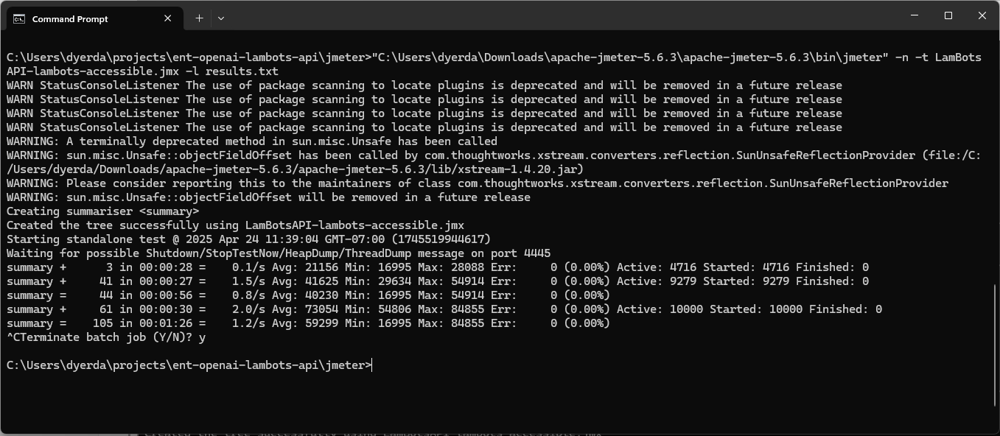

# JMeter Usage Guide


## Dependencies
- **Apache JMeter** (version 5.6 or higher recommended)
  - Download: [https://jmeter.apache.org/download_jmeter.cgi](https://jmeter.apache.org/download_jmeter.cgi)
  - Extract to a directory with no spaces in the path
- **Java Development Kit (JDK)** (version 8 or higher)
  - Download: [https://www.oracle.com/java/technologies/downloads/](https://www.oracle.com/java/technologies/downloads/)
  - Ensure JAVA_HOME environment variable is set correctly


## Running JMeter GUI on Windows
To open the JMeter GUI on Windows, use the following steps:

1. Navigate to the directory where JMeter is installed.
2. Locate the `jmeter.bat` file.
3. Double-click the `jmeter.bat` file to launch the JMeter GUI.

Alternatively, you can run the following command in the Command Prompt:

```cmd
<path-to-jmeter-installation>\bin\jmeter.bat
```

Replace `<path-to-jmeter-installation>` with the actual path to your JMeter installation directory.

## Running JMeter in CLI Mode and Exporting Data
To run JMeter in CLI (non-GUI) mode and export the results to a file, use the following command:

```cmd
<path-to-jmeter-installation>\bin\jmeter.bat -n -t <path-to-jmx-file> -l <path-to-output-file>
```

- Replace `<path-to-jmeter-installation>` with the actual path to your JMeter installation directory.
- Replace `<path-to-jmx-file>` with the path to the `.jmx` file you want to execute.
- Replace `<path-to-output-file>` with the desired path and name for the output file (e.g., `results.jtl`).

### Example
```cmd
C:\apache-jmeter-5.6\bin\jmeter.bat -n -t LamBotsAPI-lambots-accessible.jmx -l results.txt
```

## Screenshot of JMeter CLI
Below is a screenshot of the JMeter CLI in action:



# Reproducing the Maxed out Memory Issue

1. Log into Lambots-dev
2. Open your developer console -> Application > Cookies
3. Copy the value for lambots-api-access-token
4. Open Jmeter GUI
5. Load the JMX File Located inside the same directory as this README (File > Open...) 
6. Add your valid cookie copied from step 3 to the HTTP Header Manager value will be something like `Bearer <cookie value>`
7. Close the GUI
8. Run the JMeter CLI command to launch the test
9. Inspect the results.txt to ensure you are receiving HTTP 200's (if not, verify your cookie is valid)
10. Let the test run for ~3 minutes
11. stop the test
11. Repeat steps 8-11, two more times (this should cause the memory to max out but you may need to run additional times)